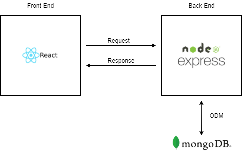

## 소개

Chaeduk의 개인 사이트⚡️⚡️⚡️

## 기술스택

| 분야     | 사용 기술         |
| -------- | ----------------- |
| FrontEnd | React             |
| BackEnd  | Express           |
| Database | MongoDB(Mongoose) |
| Deploy   | Heroku            |
| TOOL     | VSCODE, Notion    |

## 아키텍처

## 링크

- http://chaeduk.o-r.kr/
- https://young-garden-23295.herokuapp.com/ (https 적용)

## API 명세서

- https://documenter.getpostman.com/view/17744245/UUy385vp

## 커밋 메시지

- feat : 새로운 기능에 대한 커밋
- fix : 버그 수정에 대한 커밋
- refactor : 코드 리팩토링에 대한 커밋
- docs : 도큐먼트 수정에 대한 커밋
- chore : 그 외 자잘한 수정에 대한 커밋
